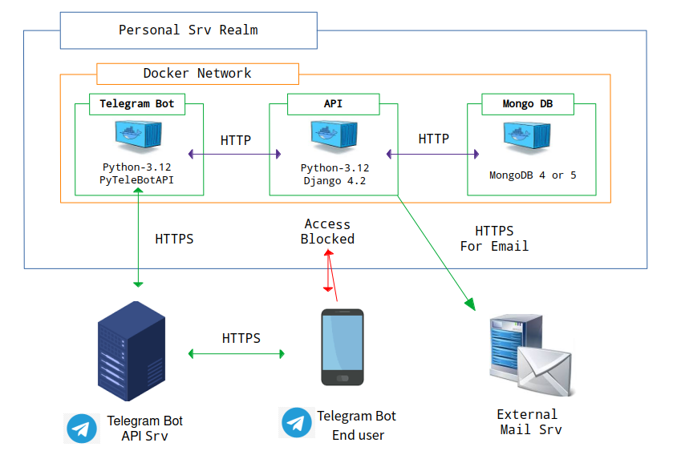
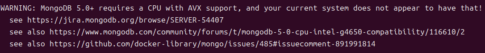

# Kryptos - Password Manager System


## Get Your Forgotten Account Information Safely Everywhere.


### I. Introduction

<p> 
In today's digital age, almost everyone has multiple online accounts. 
These accounts are used for communication, stock market transactions, e-commerce, and more. 
</p> 

<p> 
You may have experienced moments when you couldn’t recall the username or password for an account, 
especially for services you rarely use. It can be frustrating and inconvenient when you urgently need access. 
</p> 

<p> 
To avoid this, some people store account details on their PC or smartphone in plain text. 
However, this method is highly vulnerable. Others may accidentally or intentionally access this information, 
or it could be lost if the device malfunctions or is replaced.
</p> 

<p>
How can you securely store your account details and access them whenever needed? The answer is <b>Kryptos</b>. 
</p>


### II. What is Kryptos

<p>
<b>Kryptos</b> is a personal password management system built on Docker. The name <b>Kryptos</b> comes from the Greek word 'Κρύπτος', meaning 'hidden'.
</p>

<p>
With Kryptos, you can securely store account information, with passwords encrypted and stored in a database container. 
You can access this information anytime, anywhere, as long as your device has an internet connection. 
All interactions with Kryptos occur via a Telegram bot.
</p>

<p>
Kryptos can be used by individuals or groups, such as families or companies. 
Even in group settings, no one can access another person’s account information, 
as Kryptos validates your chatroom and account details before processing requests.
</p>


### III. Architecture



<p>
Kryptos is based on Docker and comprises three containers: Bot, API, and Database. 
External access is restricted except for communication via the Telegram bot.
</p>

<p>
Kryptos uses MongoDB as its database due to its scalability, avoiding traditional relational databases like MySQL or PostgreSQL. 
The database container communicates through port 27017 by default.
</p>

<p>
The API container uses Django Rest Framework for data handling. 
It is protected by CORS, allowing access only via the container's hostname, not its IP address. 
This container also handles sending activation codes to users’ emails, requiring a DNS configuration. 
It communicates via port 8000, Django’s default port.
</p>

<p>
The Bot container acts as a relay server between the Kryptos API container and Telegram users. 
It processes user requests through Telegram and retrieves responses from the API container. 
Upon initialization, it establishes communication with the Telegram Bot API server. 
</p>


### IV. How to Install

#### 1. Prerequisite
<p>
Before installing Kryptos, ensure Docker is installed. 
It is also recommended to install Docker Compose for managing multiple containers.
</p>

<p>
For optimal operation, use a desktop or laptop with a stable internet connection and uninterrupted power supply.
</p>

<ul>
  <li><a href="https://docs.docker.com/engine/install/" target="_blank">How to Install Docker</a></li>
  <li><a href="https://docs.docker.com/compose/install/standalone/" target="_blank">How to Install Docker Compose Standalone</a></li>
</ul>


#### 2. Create a 'docker-compose.yml' File

<p>
Kryptos is consist of 3 containers, Managing each individually can be time-consuming, 
so using Docker Compose is recommended.
</p>

<p>
First, create a file named 'docker-compose.yml' and copy the contents below.
</p>

```commandline
services:
  db:
    build:
      context: ./docker_mongo
      dockerfile: Dockerfile
    container_name: kryptos_db
    hostname: kryptos-db
    volumes:
      - [PATH_IN_HOST_MACHINE_TO_BACKUP_DB_DATA]:/data/db
    networks:
      - kryptos

  api:
    build:
      context: ./docker_kryptos
      dockerfile: Dockerfile
    container_name: kryptos_api
    hostname: kryptos-api
    depends_on:
      - db
    environment:
      - KRYPTOS_EMAIL_HOST_USER=[YOUR_EMAIL_PROVIDER_HOST]
      - KRYPTOS_EMAIL_HOST_PASSWORD=[YOUR_EMAIL_PROVIDER_PASSWORD]
    dns:
      - [DNS_ADDRESS]
    networks:
      - kryptos

  bot:
    build:
      context: ./docker_kryptos_bot
      dockerfile: Dockerfile
    container_name: kryptos_bot
    hostname: kryptos-bot
    depends_on:
      - api
    environment:
      - KRYPTOS_BOT_API_TOKEN=[YOUR_TELEGRAM_BOT_API_TOKEN]
    networks:
      - kryptos

networks:
  kryptos:
    driver: bridge
    ipam:
      config:
        - subnet: [KRYPTOS_SUBNET x.x.x.x/x]
```

<p>
Please be advised that you have to enter your own value on some parts of 'docker-compose.yml' file.
Refer to the following paragraph how to get your own value.
</p>


#### 2-1. Set 'api' Service
<p>
You can see the environment variables 'KRYPTOS_EMAIL_HOST_USER' and 'KRYPTOS_EMAIL_HOST_PASSWORD'.
The 'api' container has a default setting for <a href="https://support.google.com/accounts/answer/185833?" target="_blank">Google AppPass</a>
If you have a google app pass, please go to <a href="#sct_2_1_2" target="_blank">the section 2-1-2</a>. 
Or if you use another SMTP Server, please refer to <a href="#sct_2_1_3" target="_blank">the section 2_1-3</a>.
</p>


##### <span id="sct_2_1_1">2-1-1. Create Google AppPass </span>
<p>
Please refer to the blog post below, and memorize 16-digits app password at the last stage.
</p>

<p>
  <a href="https://luna-negra.github.io/django/basic%20usage/sending-mail-in-django-with-google-apppass.html#ctl2" target="_blank">
    How to create App Pass
  </a>
</p>

#### <span id="sct_2_1_2">2-1-2. Set Environment Variables </span>
<p>
Put your Google email address which has app password, for 'KRYPTOS_EMAIL_HOST_USER'
and your app password for 'KRYPTOS_EMAIL_HOST_PASSWORD'.
</p>

#### <span id="sct_2_1_3">2-1-3. Set another SMTP Server </span>
<p>
If you want to use another mail service except gmail, you have to create additional environmental variables.
</p>

```commandline
KRYPTOS_EMAIL_HOST: Enter the address of email provider's server address.
KRYPTOS_EMAIL_PORT: Enter the port for sending email with your email provider
KRYPTOS_EMAIL_USE_TLS: If you want not to use TLS, please type False or 0. Default is True.
KRYPTOS_EMAIL_USE_SSL: if you want to use SSL, please type True or 1. Default is False.
```

#### 2-2. Set 'bot' Service
<p>
Use an existing Telegram bot token for `KRYPTOS_BOT_API_TOKEN`, or follow these steps to create one
</p>

<details>
<summary> <b>[ How to Create Telegram Bot and Get API Token ]</b> </summary>
<p>
You have to create your own Telegram Bot and set it for environment variable 'KRYPTOS_BOT_API_TOKEN'.
Refer to the instruction below, create your own Telegram bot and get an API Token from your Telegram App.
</p>

```commandline
1.  Install and signup with your Telegram application on your smartphone or labtop

2.  In search window, type '@BotFather'

3.  Press 'start' button below, and type '/newbot'

4.  Type the name of your new bot. It will be exposed on your chatting list.

5.  Type the bot username ends with '_bot'. e.g) test_bot

6.  Once finishing creating new bot, type '/mybots' in text window.

7.  Select your bot

8.  Select API Token. You can get an API token for your telegram bot.
```
</details>

<p>
After getting Telegram bot API token, please set the environment variable 'KRYPTOS_BOT_API_TOKEN' with it.
</p>


#### 3. Execute docker-compose
<p>
After finishing creating your own 'docker-compose.yml' file, execute 'sudo docker-compose up -d' command at the path where 'docker-compose.yml' is located.
</p>

```commandline
sudo docker-compose up -d
```

#### 5. Install Trouble Shooting
<details>
<summary>kryptos_db container does not running</summary>
<br>
<span>
  <b>1. WARNING: MongoDB 5.0+ requires a CPU with AVX support, and your current system does not appear to have that!</b>
</span>



<p>
If you have a logs above on your kryptos_db container, you have to use 'kryptos_db4' image instead of 'kryptos_db5'.
Please edit your 'docker-compose.yml' file at db section with 'image: lunanegra4139/kryptos_db4'
</p>

</details>


### V. Version Info
<ul>
  <li>2025.06.15: Version 1.1. Publish beta version of Kryptos.</li>
  <li>2025.01.24: Version 1.0. Publish beta version of Kryptos.</li>
</ul>


### VI. Additional Information.
<span><b>2025.06.15 15:05 Sun</b></span>
<ol>
  <li><b>Version 1.1 Beta</b></li>
  <li>This is a beta version and the max number of account which you can store without license is 5.</li>
  <li>Apply Telegram Bot Framework(mizuhara) and update managing messages.</li>
</ol>
<span><b>2025.01.24 14:46 Fri</b></span>
<ol>
  <li><b>Version 1.0 Beta</b></li>
  <li>This is a beta version and the max number of account which you can store without license is 5.</li>
</ol>